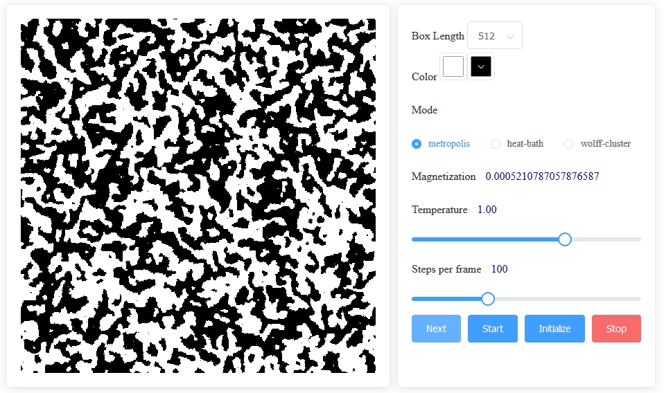

# GoIsing
>An interactive simulation of 2D Ising Model using [Vue.js](https://vuejs.org/) framework.

## About
**The Ising model** is a mathematical model of ferromagnetism in statistical mechanics. The model consists of discrete variables that represent magnetic dipole moments of atomic "spins" that can be in one of two states (+1 or −1). The spins are arranged in a lattice, allowing each spin to interact with its neighbors. The model allows the identification of phase transitions, as a simplified model of reality. The two-dimensional square-lattice Ising model is one of the simplest statistical models to show a phase transition. [[Wikipedia](https://en.wikipedia.org/wiki/Ising_model)]
## Contributors

**Navi Ning**

: Design & Theoretical Support

**Nacuang Wang**
: Programming